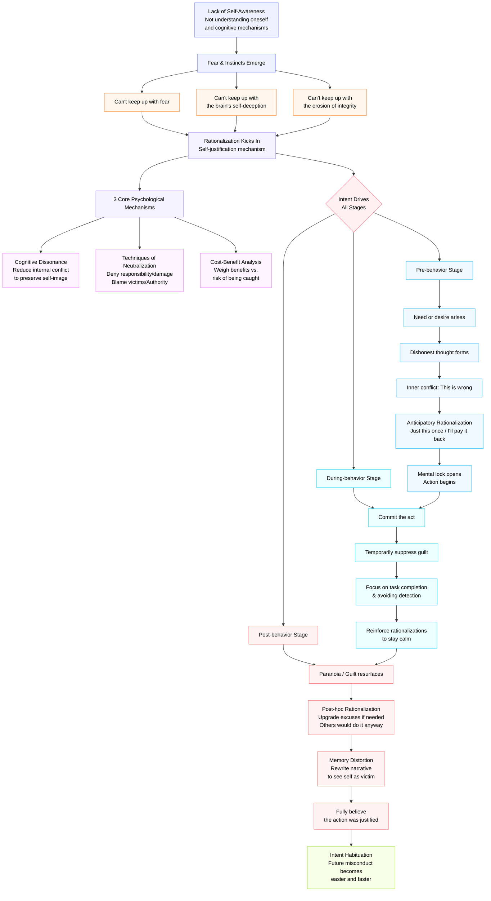

# Lack of Self-Awareness

```mermaid
---
config:
  layout: dagre
---
flowchart TD
    A[Lack of Self-Awareness<br/>Not understanding oneself<br/>and cognitive mechanisms]:::indigo --> B[Fear & Instincts Emerge]:::indigo
    B --> C1[Can't keep up with fear]:::orange
    B --> C2[Can't keep up with<br/>the brain's self-deception]:::orange
    B --> C3[Can't keep up with<br/>the erosion of integrity]:::orange
    C1 & C2 & C3 --> D[Rationalization Kicks In<br/>Self-justification mechanism]:::violet
    D --> E[3 Core Psychological Mechanisms]:::violet
    E --> E1[Cognitive Dissonance<br/>Reduce internal conflict<br/>to preserve self-image]:::fuchsia
    E --> E2[Techniques of Neutralization<br/>Deny responsibility/damage<br/>Blame victims/Authority]:::fuchsia
    E --> E3[Cost-Benefit Analysis<br/>Weigh benefits vs.<br/>risk of being caught]:::fuchsia
    D --> F{Intent Drives<br/>All Stages}:::rose
    F --> G[Pre-behavior Stage]:::sky
    G --> G1[Need or desire arises]:::sky
    G1 --> G2[Dishonest thought forms]:::sky
    G2 --> G3[Inner conflict: This is wrong]:::sky
    G3 --> G4[Anticipatory Rationalization<br/>Just this once / I'll pay it back]:::sky
    G4 --> G5[Mental lock opens<br/>Action begins]:::sky
    F --> H[During-behavior Stage]:::cyan
    H --> H1[Commit the act]:::cyan
    H1 --> H2[Temporarily suppress guilt]:::cyan
    H2 --> H3[Focus on task completion<br/>& avoiding detection]:::cyan
    H3 --> H4[Reinforce rationalizations<br/>to stay calm]:::cyan
    F --> I[Post-behavior Stage]:::red
    I --> I1[Paranoia / Guilt resurfaces]:::red
    I1 --> I2[Post-hoc Rationalization<br/>Upgrade excuses if needed<br/>Others would do it anyway]:::red
    I2 --> I3[Memory Distortion<br/>Rewrite narrative<br/>to see self as victim]:::red
    I3 --> I4[Fully believe<br/>the action was justified]:::red
    G5 --> H1
    H4 --> I1
    I4 --> J[Intent Habituation<br/>Future misconduct becomes<br/>easier and faster]:::lime
    classDef indigo stroke:#818cf8,fill:#eef2ff,color:#000
    classDef orange stroke:#fb923c,fill:#fff7ed,color:#000
    classDef violet stroke:#a78bfa,fill:#f5f3ff,color:#000
    classDef fuchsia stroke:#e879f9,fill:#fdf4ff,color:#000
    classDef rose stroke:#fb7185,fill:#fff1f2,color:#000
    classDef sky stroke:#38bdf8,fill:#f0f9ff,color:#000
    classDef cyan stroke:#22d3ee,fill:#ecfeff,color:#000
    classDef red stroke:#f87171,fill:#fef2f2,color:#000
    classDef lime stroke:#a3e635,fill:#f7fee7,color:#000
```
