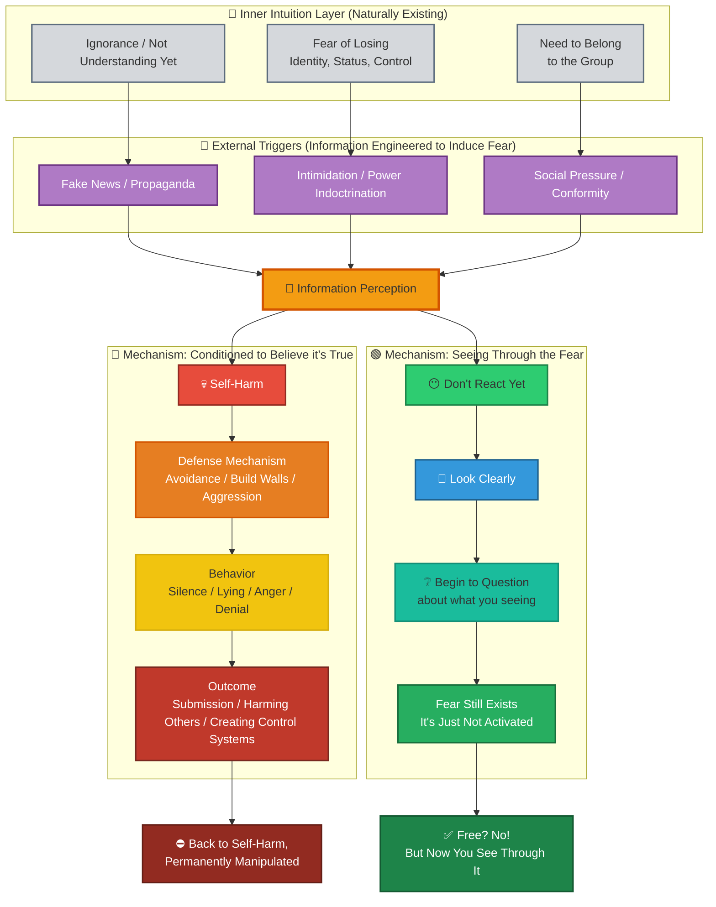

```mermaid
flowchart TD
    %% ===== Layer 1: Inner Intuition (Seed) =====
    subgraph Layer1["🧬 Inner Intuition Layer (Naturally Existing)"]
        direction LR
        S1[Ignorance / Not Understanding Yet]
        S2[Fear of Losing<br>Identity, Status, Control]
        S3[Need to Belong<br>to the Group]
    end

    %% ===== Layer 2: External Triggers (Information Engineered to Induce Fear) =====
    subgraph Layer2["📡 External Triggers (Information Engineered to Induce Fear)"]
        direction LR
        T1[Fake News / Propaganda]
        T2[Intimidation / Power Indoctrination]
        T3[Social Pressure / Conformity]
    end

    %% Connecting intuition + engineered info -> response
    S1 --> T1
    S2 --> T2
    S3 --> T3
    
    T1 --> React[👤 Information Perception]
    T2 --> React
    T3 --> React

    %% ===== Left Track: Old Loop (Conditioned) =====
    subgraph LeftTrack["🔴 Mechanism: Conditioned to Believe it's True"]
        direction TB
        L1[💀 Self-Harm] --> L2[Defense Mechanism<br>Avoidance / Build Walls / Aggression]
        L2 --> L3[Behavior<br>Silence / Lying / Anger / Denial]
        L3 --> L4[Outcome<br>Submission / Harming Others / Creating Control Systems]
    end

    %% ===== Right Track: New Loop (Awareness) =====
    subgraph RightTrack["🟢 Mechanism: Seeing Through the Fear"]
        direction TB
        R1[😶 Don't React Yet] --> R2[👀 Look Clearly]
        R2 --> R3[❔ Begin to Question<br>about what you seeing]
        R3 --> R4[Fear Still Exists<br>It's Just Not Activated]
    end

    %% Connecting from perception to both paths
    React --> L1
    React --> R1

    %% Final outcomes
    L4 --> End1[⛔ Back to Self-Harm,<br>Permanently Manipulated]
    R4 --> End2[✅ Free? No!<br>But Now You See Through It]

    %% ===== Color styling for visualization =====
    %% Intuition (gray/neutral tones showing inherent neutrality)
    style S1 fill:#d5d8dc,stroke:#5d6d7e,stroke-width:2px,color:#333
    style S2 fill:#d5d8dc,stroke:#5d6d7e,stroke-width:2px,color:#333
    style S3 fill:#d5d8dc,stroke:#5d6d7e,stroke-width:2px,color:#333

    %% Data triggers (purple/hot pink showing intense external stimuli)
    style T1 fill:#af7ac5,stroke:#6c3483,stroke-width:2px,color:#fff
    style T2 fill:#af7ac5,stroke:#6c3483,stroke-width:2px,color:#fff
    style T3 fill:#af7ac5,stroke:#6c3483,stroke-width:2px,color:#fff
    style React fill:#f39c12,stroke:#d35400,stroke-width:3px,color:#333

    %% Left side - warm tones
    style L1 fill:#e74c3c,stroke:#922b21,stroke-width:2px,color:#fff
    style L2 fill:#e67e22,stroke:#d35400,stroke-width:2px,color:#fff
    style L3 fill:#f1c40f,stroke:#d4ac0d,stroke-width:2px,color:#333
    style L4 fill:#c0392b,stroke:#78281f,stroke-width:2px,color:#fff
    style End1 fill:#922b21,stroke:#641e16,stroke-width:2px,color:#fff

    %% Right side - cool tones
    style R1 fill:#2ecc71,stroke:#1e8449,stroke-width:2px,color:#333
    style R2 fill:#3498db,stroke:#1f618d,stroke-width:2px,color:#fff
    style R3 fill:#1abc9c,stroke:#148f77,stroke-width:2px,color:#333
    style R4 fill:#27ae60,stroke:#196f3d,stroke-width:2px,color:#fff
    style End2 fill:#1e8449,stroke:#145a32,stroke-width:2px,color:#fff
```