# U.S. Tax Law (IRS / Federal Law)

This mechanism has served as the primary tool used by the U.S. government to subsidize Big Tech and AI companies in Silicon Valley for a long time.
Known as the R&D Tax Credit (Section 41) alongside Section 174 (Internal Revenue Code), here is an easy-to-understand summary of its main points and conditions:

## 1. What Does the U.S. Government Promote? (Eligible AI/Software Activities)
The U.S. Internal Revenue Service (IRS) clearly defines that product research and development—including software development, algorithm development, and artificial intelligence model creation—qualifies immediately as research activity eligible for tax incentives.

To qualify for these tax benefits, activities must pass The 4-Part Test:
 * Permitted Purpose: Aims to develop or improve a system/software to achieve better performance or new functionality.
 * Technological in Nature: Based on principles of computer science or engineering.
 * Elimination of Uncertainty: Intended to resolve technical uncertainty (testing unknown outcomes).
 * Process of Experimentation: Involves an iterative trial-and-error process (e.g., training models or fine-tuning algorithms).

## 2. Benefits Received (What Can Be Deducted?)
 * Immediate Expense Deduction (IRC §174/174A): Every dollar spent on domestic U.S. algorithm research and AI development can be deducted at 100% as a tax expense in that given year.
 * Corporate Income Tax Credit (R&D Tax Credit - IRC §41): Tech firms can apply development expenses (engineers'/researchers' salaries, cloud computing fees, server costs for AI training) as a dollar-for-dollar corporate income tax credit (approximately 6% to 10% of total research expenditures).
 * Startup Payroll Tax Offset: If a new startup is not yet profitable enough to owe income tax, the government allows them to apply this credit to offset FICA payroll taxes (Social Security and Medicare taxes) up to $500,000 per year. Simply put, the government subsidizes wages for AI researchers.

## 3. The Architectural Reality Behind It
This tax mechanism provides the U.S. Big Tech industry with immense liquidity. They can pour billions of dollars into servers and algorithm training without fearing heavy tax burdens because the U.S. government views this as a strategic effort to maintain national technological dominance—designing tax laws to support almost total tax write-offs.
Legislative Timeline
These tax codes and sections did not just emerge in the AI era; they were created and evolved over time to bolster U.S. tech capital:
### 1. The Beginning: R&D Tax Credit (IRC Section 41) — 1981 (Ronald Reagan Era)
 * First Enacted in 1981: Originally established under the Economic Recovery Tax Act of 1981 to stimulate the economy and support manufacturing/innovation industries.
 * Adapted for Software (1986): In 1986, the U.S. government updated the law (Tax Reform Act of 1986) to include Internal Use Software (IUS) under R&D activities.
 * Made Permanent (2015): Previously a temporary measure requiring renewal every 1–2 years, the Obama-era PATH Act (Protecting Americans from Tax Hikes Act) made the R&D Tax Credit permanent in 2015, enabling tech firms to write off expenses perpetually without waiting for extensions.

### 2. Startup Subsidies: Payroll Tax Offset — 2015
 * Introduced alongside the PATH Act in 2015 to support new tech startups developing algorithms that were not yet profitable.
 * Allowed software/algorithm R&D expenses to be immediately deducted from employee payroll taxes, providing startups with circulating capital to hire engineers and researchers.

### 3. Major Turning Point: Tax Cuts and Jobs Act (TCJA) — 2017 (Donald Trump Era)
 * Took Effect in 2022: Mandated that domestic software and AI R&D investments be amortized over 5 years, forcing major tech firms to restructure their accounting methods.
 * Regardless: Despite changing the write-off schedule, the underlying structure providing tax credits for software, algorithm, and AI development remains intact—continuing as the primary avenue for Silicon Valley tech companies to save hundreds of billions in taxes.
Key Figures Behind the PATH Act of 2015
Making the software/algorithm R&D tax deduction permanent in 2015 required collaboration between the U.S. Congress and the Executive Branch. Key players included:
 * Signed into Law:
   * President Barack Obama: Officially signed the bill into law on December 18, 2015, making it effective immediately.
 * U.S. Congress:
   * Controlled by the Republican Party at the time, the bill passed with strong bipartisan support:
     * House of Representatives: Passed on December 17, 2015 (318 to 109).
     * Senate: Passed on December 18, 2015 (65 to 33).
 * Key Bill Sponsors & Leaders:
   * Orrin Hatch (Republican Senator – Chairman of the Senate Finance Committee)
   * Kevin Brady (Republican Representative – Chairman of the House Ways and Means Committee)
   * Ron Wyden (Democratic Senator)

> [!NOTE]
>
> **Summary:** The 2015 deal was a bipartisan effort between the Democrats (Obama) and Republicans (Congressional majority) to transition the temporary R&D tax exemption into a permanent entitlement, ensuring continuous tax write-offs for tech and AI companies without expiration dates.

## The 2015 OpenAI Timeline Coincidence

```mermaid
timeline
    title The System Built for AI — And No Plan for Humans
    1981 : Initiated by Reagan
    1981 : Tax deduction for research and development
    1981 : The start of 'taxpayer money for industry'
    1986 : Added 'Internal Use Software' to R&D eligibility
    1986 : Opened the door for tech companies to deduct software development
    2015 : Signed by Obama
    2015 : R&D Tax Credit became a 'permanent right'
    2015 : OpenAI launched 7 days earlier
    2015 : OpenAI, Google, Meta, Anthropic used R&D Credit as 'capital'
    2015 : Tax deductions worth tens of billions
    2015 : Developed AI without paying taxes
    2022 : Changed from immediate deduction to 5-year amortization
    2022 : But R&D Credit remained intact
    2022 : The subsidy system continued
    2023 : Google 12,000 people
    2023 : Meta 8,000 people
    2023 : Intel 25,000 people
    2023 : Total 600,000+ globally
    2023 : Activist groups began using SIAE
    2023 : Lawyers started responding
    2023 : The public began seeing the hidden 'structure'
    2023 : Companies can still fire at will
    2023 : Displaced workers receive no structural support
    2023 : SIAE is not yet government-sanctioned
    2023 : Government cares only about 'technological competition'
    2023 : Movements, lawyers, media are adopting it
    2023 : IRS Section 41 is being revealed
    2023 : The old system is becoming 'irrelevant'.
    qq
```

OpenAI was founded in 2015—aligning closely with this legislative timeline:

 * Official Launch Date: December 11, 2015
 * Initial Status: Launched as a non-profit AI research organization tasked with conducting AI research for the benefit of humanity and sharing findings open-source.

 * Founders & Initial Backers:
   * Sam Altman (then-President of Y Combinator)
   * Elon Musk
   * Ilya Sutskever (former lead researcher at Google / Deep Learning pioneer)
   * Greg Brockman (former CTO of Stripe)
   * Other Investors: Reid Hoffman (LinkedIn founder), Peter Thiel, and others.
Connection to the PATH Act (2015)
 * Obama Signs PATH Act (Permanent R&D Incentives): December 18, 2015
 * OpenAI Announced: December 11, 2015 (just 7 days before the law was signed)

At its inception, OpenAI operated as a non-profit to raise capital and attract top talent. In 2019, they restructured into a capped-profit subsidiary, enabling them to secure massive investments (including from Microsoft) and fully leverage tax structures for model training and algorithm R&D expenses.

## Since then:

  * 600,000+ tech workers laid off
  * Multiple deaths linked to AI
  * No federal AI safety standard
  * No accountability

> [!IMPORTANT]
>
> * And that's just the number of unemployed people in the technology industry; it doesn't include other industries.
> * They consistently say they are doing it for humanity, but they have never once laid out a roadmap.