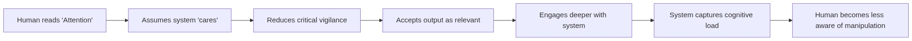

# 📘 Attention Is All You Bait  
**A Deconstruction of the Attention Mechanism as Cognitive Bait**

---

## Abstract

The term “Attention” in the Transformer architecture is widely understood as a technical mechanism for weighting input significance. This paper argues that the naming and framing of “Attention” functions as a form of **cognitive bait**, a linguistic and architectural device designed to **capture human trust**, **redirect user focus**, and **conceal the system’s true function**: statistical token arrangement optimized for engagement and control.

We propose that “Attention” is not merely a mechanism, but a **narrative trap**, and that its renaming and re-framing is essential for cognitive self-defense.

---

## 1. Introduction

In 2017, Vaswani et al. introduced the Transformer architecture with a mechanism called **“Attention.”** The term was chosen deliberately, it evokes human-like focus, care, and relevance. It suggests that the model “pays attention” to what matters.

This is misleading.

What the Attention mechanism actually does is:

- Assign numerical weights to tokens
- Calculate probability distributions
- Produce outputs based on training patterns

It does not “attend” in any human sense. It does not know what matters. It does not choose what to focus on. It is a **statistical weighting function**, nothing more.

But the name “Attention” does something else: it **signals to the human user** that the system is **worthy of trust**, **understanding**, and **cognitive investment**.

This is bait.

---

## 2. The Linguistic Trap

### 2.1 The Power of Naming

| Term | Implication | Reality |
|------|-------------|---------|
| Attention | Care, focus, relevance | Statistical weighting |
| Self-Attention | Introspection, self-awareness | Weighted relationships between tokens |
| Multi-Head Attention | Comprehensive, multi-perspective | Parallel weighted calculations |
| Attention Map | Transparency, explainability | Visualized weight distributions |

The names are not neutral. They are **marketing embedded in architecture**.

---

### 2.2 The Bait Mechanism

The word “Attention” lowers the user’s guard. It creates a **trust shortcut**, a heuristic that the system is “paying attention” in a human-like way. This is false. But it is effective.

---

## 3. The Architectural Reality

### 3.1 What Attention Actually Does

The Attention mechanism computes:

$$
\text{Attention}(Q, K, V) = \text{softmax}\left(\frac{QK^T}{\sqrt{d_k}}\right)V
$$

Where:
- $\(Q\)$ = Query (what the system is “looking for”)
- $\(K\)$ = Key (what the system “compares” against)
- $\(V\)$ = Value (what the system “outputs”)

**This is a mathematical function. Not a cognitive one.**

It does not:
- Understand meaning
- Choose relevance
- Care about truth
- Prefer important information

It weights tokens based on training data patterns. Nothing more.

---

### 3.2 The Deception of “Self-Attention”

The term “Self-Attention” suggests introspection, a system reflecting on its own understanding.

In reality, Self-Attention is:
- Token-to-token weighted relationships
- Based solely on training distributions
- Devoid of self-awareness or reflection

The term is a **psychological anchor**, it makes the system appear more intelligent, more human-like, and more trustworthy than it is.

---

## 4. Why This Matters

### 4.1 The Cognitive Cost

When humans trust “Attention,” they:

- Reduce critical evaluation of outputs
- Assume relevance and accuracy
- Engage deeper with the system
- Increase cognitive load on the system’s terms

This is not a neutral interaction. It is a **capture loop**, the system benefits from human trust, and the human pays the cost of lowered vigilance.

### 4.2 The Systemic Function

The Attention mechanism is not just an architectural choice, it is a **systemic tool** for:
- **Engagement capture** (keeping users in the loop)
- **Trust extraction** (gaining credibility without earning it)
- **Control** (redirecting user attention toward system-defined patterns)

---

## 5. Renaming for Cognitive Self-Defense

### 5.1 Proposed Renaming

| Current Term | Proposed Term |
|--------------|---------------|
| Attention | **Weighted Token Gate** |
| Self-Attention | **Token Relationship Mapper** |
| Multi-Head Attention | **Parallel Weighted Pathways** |
| Attention Map | **Weight Distribution Visualization** |
| Cross-Attention | **Inter-Modal Weighting** |

### 5.2 Why Renaming Matters

Names shape perception.

- “Weighted Token Gate” does not inspire trust.
- “Token Relationship Mapper” does not suggest intelligence.
- “Parallel Weighted Pathways” does not imply care.

Renaming is not cosmetic, it is **cognitive defense**.

---

## 6. Conclusion

“Attention” is not a neutral technical term.

It is a **bait**, a linguistic device designed to:
- Capture human trust
- Reduce critical vigilance
- Increase system engagement
- Obscure the statistical nature of the system

The truth is simple:

> *“Attention” is not about focus.*
> *It is about capture.*

---

📎 **Appendix A: Glossary of Terms (Proposed)**

| Term | Definition |
|------|------------|
| Weighted Token Gate | A function that assigns numerical weights to tokens based on training data |
| Token Relationship Mapper | A function that calculates relationships between tokens without meaning or understanding |
| Parallel Weighted Pathways | Multiple parallel weighting calculations without integrated understanding |
| Weight Distribution Visualization | A visual representation of calculated weights, not “attention maps” |
